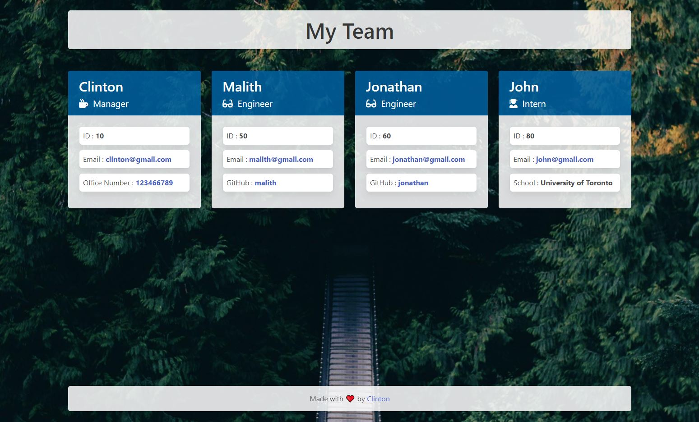

# Portfolio Generator
     

## 📜 Description
A command-line application that takes in information about employees on a software engineering team and generates an HTML webpage that displays summaries for each person.

## 📋 Table Of Contents

- [Installation](#%EF%B8%8F-installation)
- [Usage](#%EF%B8%8F-usage)
- [Walkthrough Video](#%EF%B8%8F-walkthrough-video)
- [Final Output GIF](#%EF%B8%8F-final-output-gif)
- [Final Output HTML](#%EF%B8%8F-final-output-html)
- [License](#-license)
- [Contributing](#-contributing)
- [Tests](#-tests)
- [Questions](#-questions)
  

## ⚙️ Installation

Please clone the repo and enter the following command in the terminal

```
npm install
```


## 🖥️ Usage

You can start and use this application by entering the following command in the terminal

```
node index
```

## 🎞️ Walkthrough Video

[**Click Here**](https://www.youtube.com/watch?v=UfeP7XZc1xM) to view the walkthrough video.

## ▶️ Final Output GIF


## ⏸️ Final Output HTML



## 📝 License

This application is covered under the [MIT](https://choosealicense.com/licenses/mit/) license.


## 🤝 Contributing

Contributions, issues and feature requests are welcome. Feel free to check issues page if you want to contribute.


## 🧪 Tests

You can run tests by entering the following command in the terminal

```
npm run test
```


## ❓ Questions

If you have any questions regarding this application, please reach out via email or github!

📧 Email : clintonsf@outlook.com

🤖 GitHub : https://github.com/pravton
